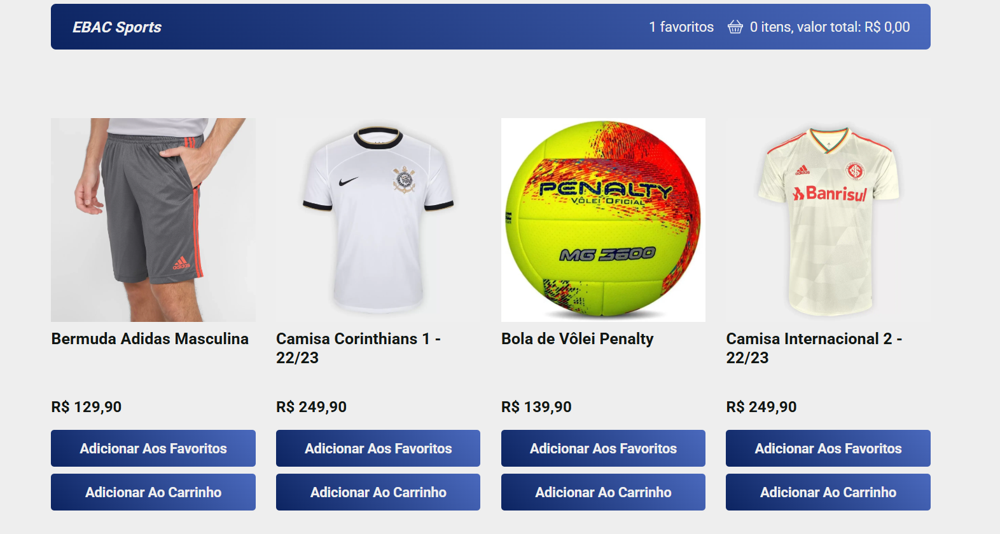

# 🏪 EBAC Sports - E-commerce

Uma aplicação de e-commerce moderna desenvolvida com React e TypeScript, focada em produtos esportivos com funcionalidades de carrinho de compras e lista de favoritos.

## 📸 Screenshot


*Interface do E-commerce EBAC Sports com produtos, carrinho e favoritos*

## 🚀 Funcionalidades

- **Catálogo de Produtos**: Exibição dinâmica de produtos esportivos
- **Carrinho de Compras**: Adicionar/remover produtos com cálculo automático do total
- **Lista de Favoritos**: Sistema de favoritos para produtos preferidos
- **Estado Global**: Gerenciamento de estado com Redux Toolkit
- **API Integration**: Integração com API para busca de produtos
- **Loading States**: Estados de carregamento para melhor UX
- **Design Responsivo**: Interface adaptável para diferentes dispositivos
- **TypeScript**: Tipagem estática para maior segurança no desenvolvimento

## 🛠️ Tecnologias Utilizadas

- **React 18.2.0** - Biblioteca para construção da interface
- **TypeScript 4.9.5** - Superset do JavaScript com tipagem estática
- **Redux Toolkit 2.8.2** - Gerenciamento de estado global
- **React Redux 9.2.0** - Integração React com Redux
- **Styled Components 5.3.6** - CSS-in-JS para estilização
- **Create React App** - Ferramenta de build e desenvolvimento
- **ESLint + Prettier** - Linting e formatação de código

## 📋 Pré-requisitos

- Node.js (versão 16 ou superior)
- npm ou yarn

## 🚀 Como Executar

1. **Clone o repositório**
   ```bash
   git clone <url-do-repositorio>
   cd ebac_sports
   ```

2. **Instale as dependências**
   ```bash
   npm install
   ```

3. **Execute o projeto em modo de desenvolvimento**
   ```bash
   npm start
   ```

4. **Acesse a aplicação**
   - Abra seu navegador e acesse `http://localhost:3000`

## 📦 Scripts Disponíveis

- `npm start` - Inicia o servidor de desenvolvimento
- `npm run build` - Gera build de produção
- `npm test` - Executa os testes
- `npm run lint` - Executa o linter ESLint com correção automática
- `npm run eject` - Ejecta do Create React App (irreversível)

## 🏗️ Estrutura do Projeto

```
src/
├── components/
│   ├── Header/           # Cabeçalho com carrinho e favoritos
│   └── Produto/          # Componente individual de produto
├── containers/
│   └── Produtos.tsx      # Container principal dos produtos
├── services/
│   └── api.ts           # Configuração da API
├── store/
│   └── index.ts         # Configuração do Redux store
├── styles/
│   └── GlobalStyle.ts   # Estilos globais
├── assets/              # Imagens e recursos
├── App.tsx              # Componente raiz
└── index.tsx            # Ponto de entrada da aplicação
```

## 🎯 Como Usar

1. **Visualize os Produtos**: A página principal exibe todos os produtos disponíveis
2. **Adicione ao Carrinho**: Clique no botão de adicionar para incluir produtos no carrinho
3. **Gerencie Favoritos**: Use o sistema de favoritos para marcar produtos preferidos
4. **Monitore o Carrinho**: O header mostra a quantidade de itens e valor total
5. **Navegação**: Interface intuitiva para uma experiência de compra fluida

## 🏪 Funcionalidades do E-commerce

### 🛒 **Carrinho de Compras**
- Adicionar produtos
- Remover produtos
- Cálculo automático do valor total
- Contador de itens no header

### ❤️ **Sistema de Favoritos**
- Marcar produtos como favoritos
- Contador de favoritos no header
- Persistência do estado

### 📱 **Interface Responsiva**
- Design adaptável para mobile e desktop
- Componentes otimizados para diferentes telas
- UX intuitiva e moderna

## 🔧 Arquitetura

### **Estado Global (Redux)**
- **Carrinho**: Gerencia itens adicionados
- **Favoritos**: Controla lista de produtos favoritos
- **API**: Cache de dados dos produtos

### **Componentes**
- **Header**: Exibe informações do carrinho e favoritos
- **Produtos**: Lista dinâmica de produtos
- **Produto**: Card individual de produto

## 🎨 Características do Design

- **Styled Components**: CSS-in-JS para estilização modular
- **Design System**: Componentes reutilizáveis
- **Responsividade**: Adaptação automática para diferentes dispositivos
- **UX Otimizada**: Interface intuitiva e fácil de usar

## 🧪 Testes

O projeto inclui configuração para testes com:
- **Jest**: Framework de testes
- **React Testing Library**: Utilitários para testes de componentes
- **User Event**: Simulação de interações do usuário

## 📝 Licença

Este projeto está sob a licença MIT. Veja o arquivo [LICENSE](LICENSE) para mais detalhes.

## 👨‍💻 Desenvolvido por

[Seu Nome] - [Seu Email]

---

**Nota**: Este é um projeto de demonstração de e-commerce desenvolvido como parte do curso EBAC.
